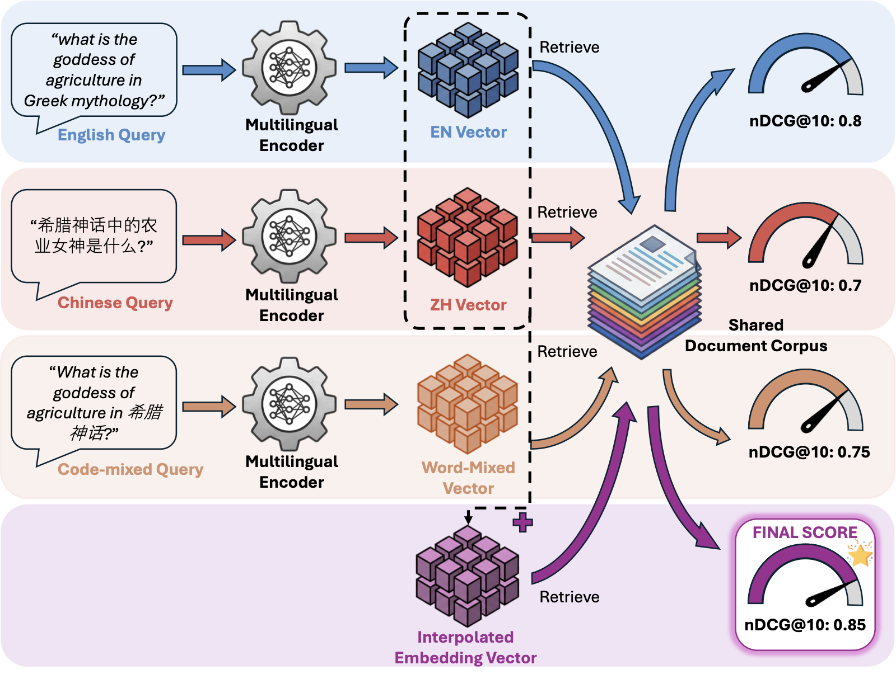
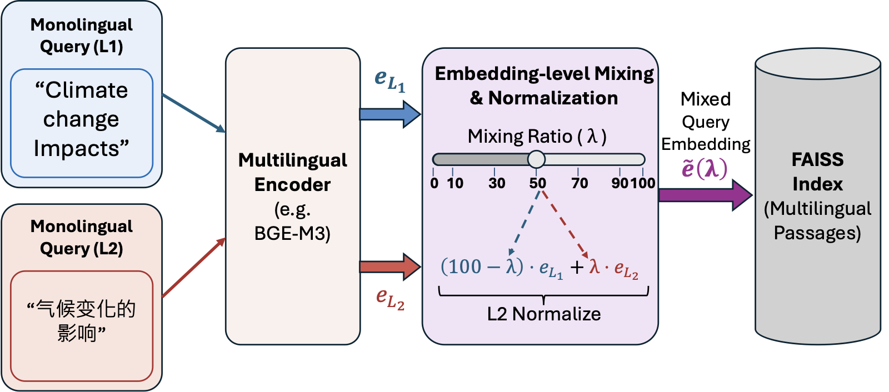
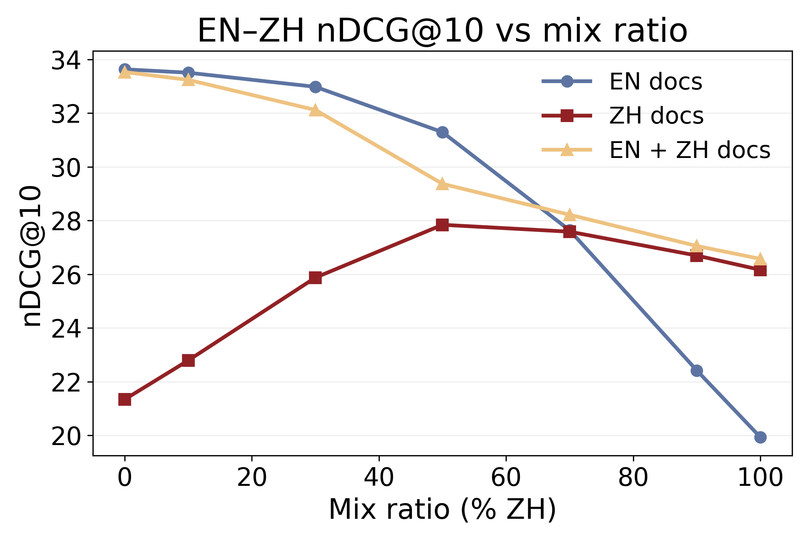
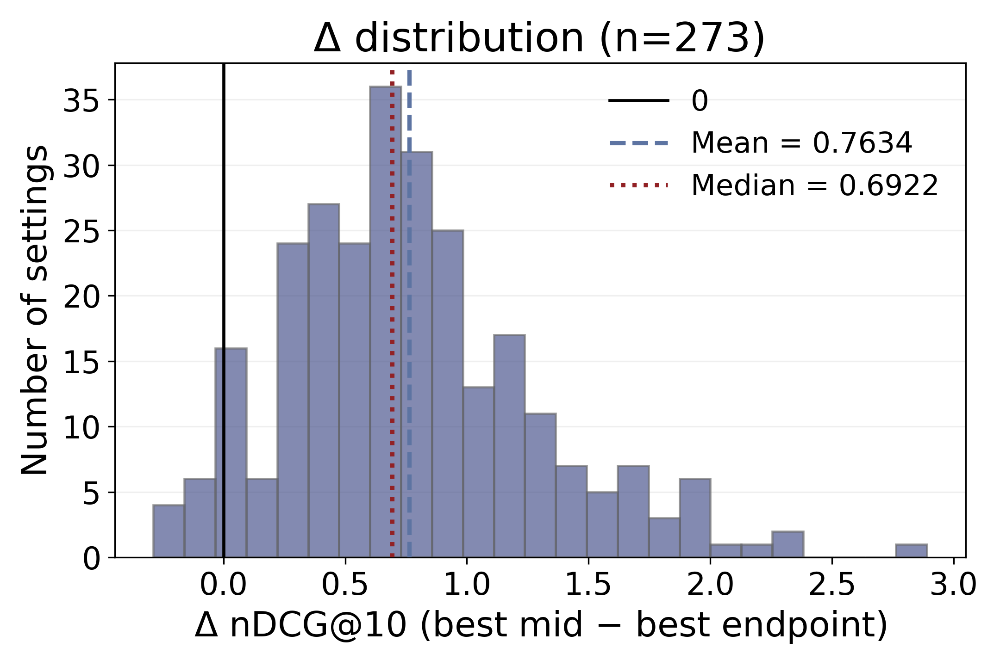
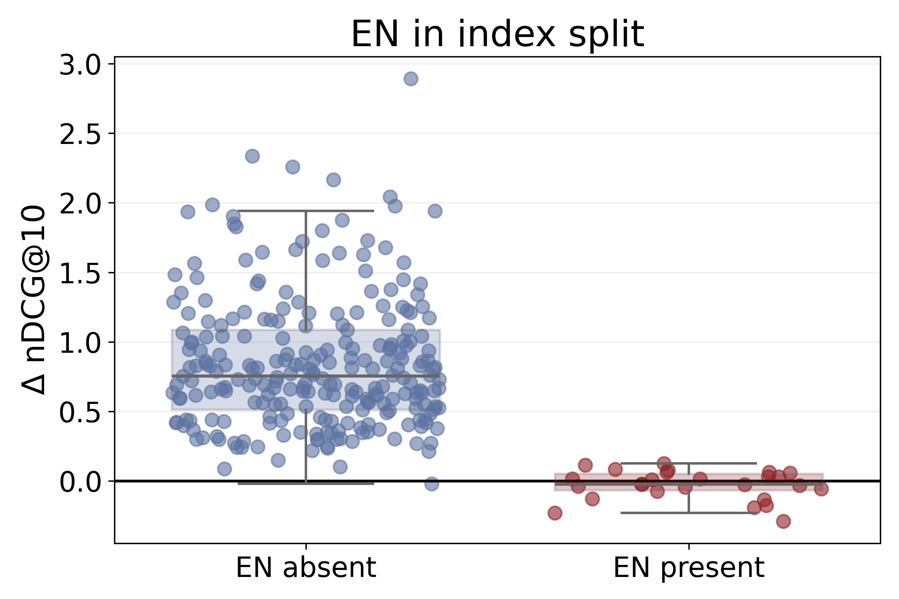
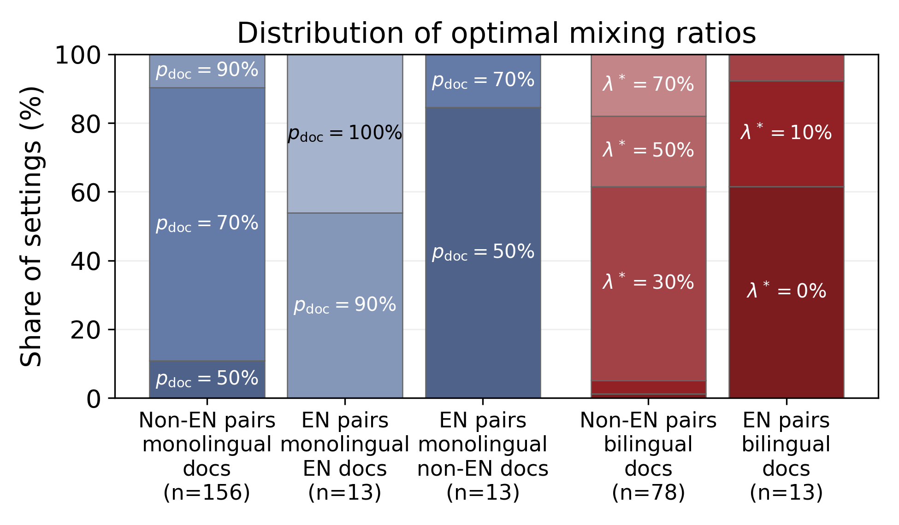
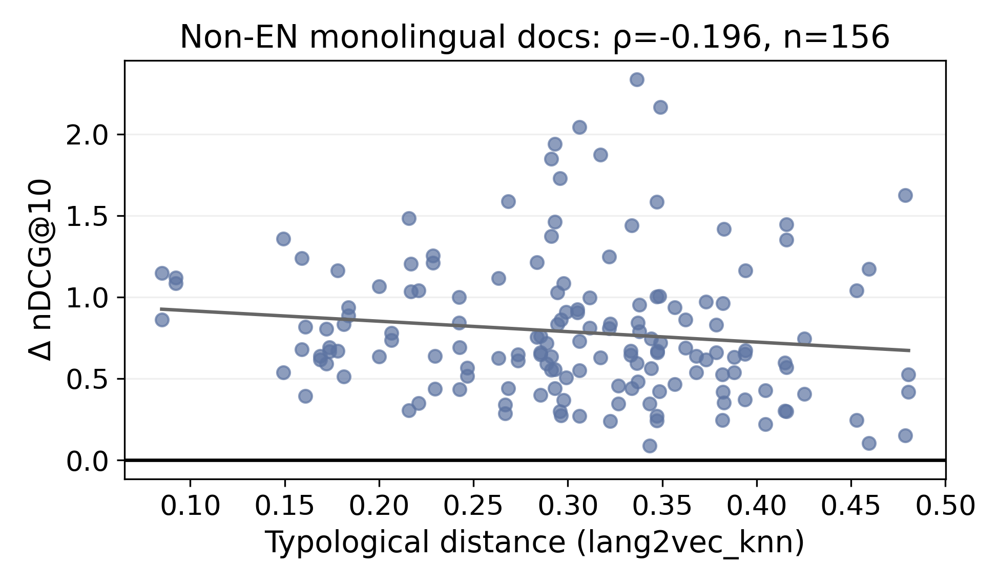

<div align="center">

# When Does Mixing Help? Analyzing Query Embedding Interpolation in Multilingual Dense Retrieval

Code implementation for our ACL 2026 paper<br>
Tongyao Zhu, Chao-Ming Huang, and Min-Yen Kan

[](LICENSE)
[](requirements.txt)
[](CITATION.cff)

<table>
  <tr>
    <td align="center" width="33%">
      
      <br>
      <sub>Paper Fig. 1: study protocol</sub>
    </td>
    <td align="center" width="33%">
      
      <br>
      <sub>Paper Fig. 2: embedding mix</sub>
    </td>
    <td align="center" width="33%">
      
      <br>
      <sub>Main EN-ZH curve</sub>
    </td>
  </tr>
</table>

</div>

This repository contains the code implementation for our paper on mixed-language queries in multilingual dense retrieval.

Multilingual users often mix languages in real search queries, but dense retrievers are usually tested with queries written in only one language. We study what happens when the query representation itself is mixed.

Given two parallel query translations, we encode both versions, interpolate their embeddings, normalize the result, and retrieve directly from a FAISS index:

$$
\tilde{\mathbf e}(\lambda)=
\frac{(1-\lambda/100)\mathbf e_{L_1}+(\lambda/100)\mathbf e_{L_2}}
{\left\|(1-\lambda/100)\mathbf e_{L_1}+(\lambda/100)\mathbf e_{L_2}\right\|_2},
\quad
\lambda \in \{0,10,30,50,70,90,100\}.
$$

The main paper study covers 35 language pairs across three document-language settings per pair. We also include a larger 91-pair result table for readers who want to explore beyond the paper subset.

## Main Results 🔎

| Question | What we find |
| --- | --- |
| ✅ Does mixing help? | Yes, often. The best mixed query embedding beats the better monolingual endpoint in 88/105 main BGE-M3 settings. |
| 🇬🇧 When does mixing fail? | Almost all failures happen when English documents are in the index. |
| 🧭 What role does English play? | English behaves asymmetrically: it is the strongest partner for non-English document retrieval, but adding non-English signal to English-document retrieval usually does not help. |
| 🎚️ Where is the best ratio? | Monolingual document indexes usually prefer a query vector that leans toward the document language, but not always the pure endpoint. |
| 🌐 Do language factors matter? | After controlling for English dominance, larger typological distance is associated with smaller mixing gains. |

<p align="center">
  
  
</p>

<p align="center">
  
  
</p>

## What You Will Find Here 📦

```text
query_embedding_mix/   Python code for indexing, retrieval, mixing, and analysis
scripts/               Scripts for reproducing the main experiments
artifacts/tables/      Result tables used by the paper
assets/figures/        Paper figures shown above
configs/               Language metadata and qid filters
docs/                  Reproduction notes, ablations, appendix workflows, and paper maps
```

Large generated directories such as `data/`, `indexes/`, `runs/`, `results/`, and `logs/` are ignored so the repo stays easy to clone.

## Reproduce The Main Run 🚀

Install the environment first:

```bash
conda create -n query-mix python=3.11.13 -y
conda activate query-mix
conda install -c conda-forge faiss-gpu=1.8.0 -y
pip install -r requirements.txt
```

Then download aligned mMARCO development queries:

```bash
python query_embedding_mix/download_mmarco_queries.py \
  --out_dir ./data/mmarco_dev \
  --split dev \
  --languages english chinese french german italian spanish portuguese dutch russian japanese arabic hindi indonesian vietnamese
```

Run the main vector-mix pipeline:

```bash
bash scripts/run_encode_index_groups.sh

INDEX_ROOT=./indexes/idx-mmarco-bge-m3-sub8841823 \
bash scripts/run_all_vector_pairs.sh

python query_embedding_mix/collect_results.py \
  ./results/mmarco_full \
  --output ./artifacts/tables/full_mmarco_results.csv \
  --processed-out ./artifacts/tables/full_mmarco_processed_results.csv
```

You can also regenerate the figures and paper values from the included tables:

```bash
python query_embedding_mix/plot_paper_figures.py
python query_embedding_mix/calculate_paper_values.py
```

The full command list, including word-mix validation and ablations, is in [docs/REPRODUCTION.md](docs/REPRODUCTION.md).

## Where To Go Next 🧭

| If you want to... | Go here |
| --- | --- |
| Understand how the paper maps to this repo | [docs/paper/README.md](docs/paper/README.md) |
| Reproduce the main experiments | [docs/REPRODUCTION.md](docs/REPRODUCTION.md) |
| Inspect the included result files | [docs/ARTIFACTS.md](docs/ARTIFACTS.md) |
| Run word-mix validation | [docs/appendix/README.md](docs/appendix/README.md) |
| Study model-family and scale ablations | [docs/ablations/README.md](docs/ablations/README.md) |
| Find the role of each script | [scripts/README.md](scripts/README.md) |

## Citation ✍️

If this code is useful for your research, please cite our ACL 2026 paper:

```bibtex
@inproceedings{zhu2026queryembeddingmix,
  title     = {When Does Mixing Help? Analyzing Query Embedding Interpolation in Multilingual Dense Retrieval},
  author    = {Zhu, Tongyao and Huang, Chao-Ming and Kan, Min-Yen},
  booktitle = {Proceedings of the Annual Meeting of the Association for Computational Linguistics},
  year      = {2026}
}
```
